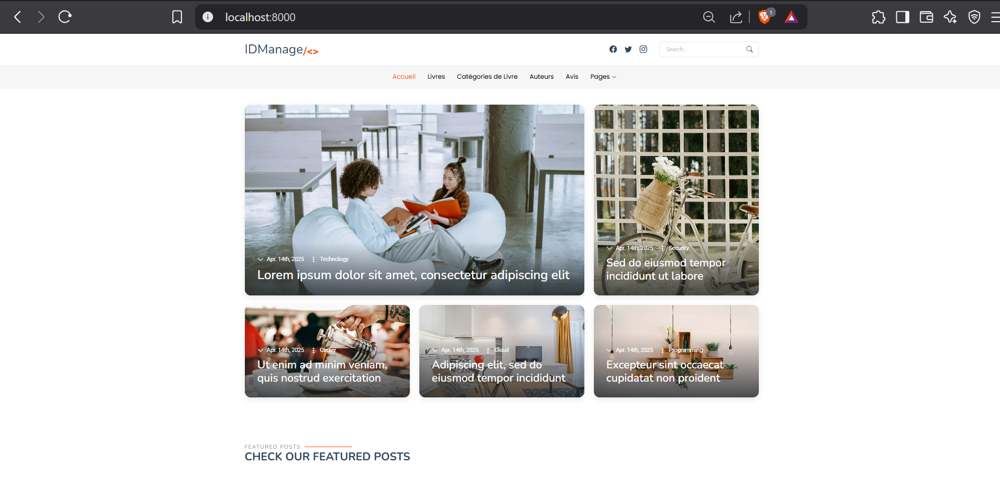
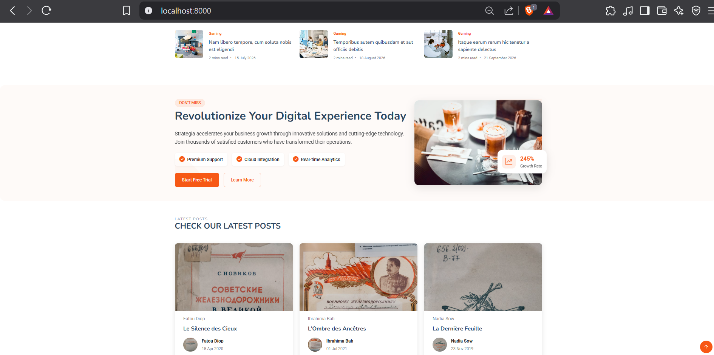
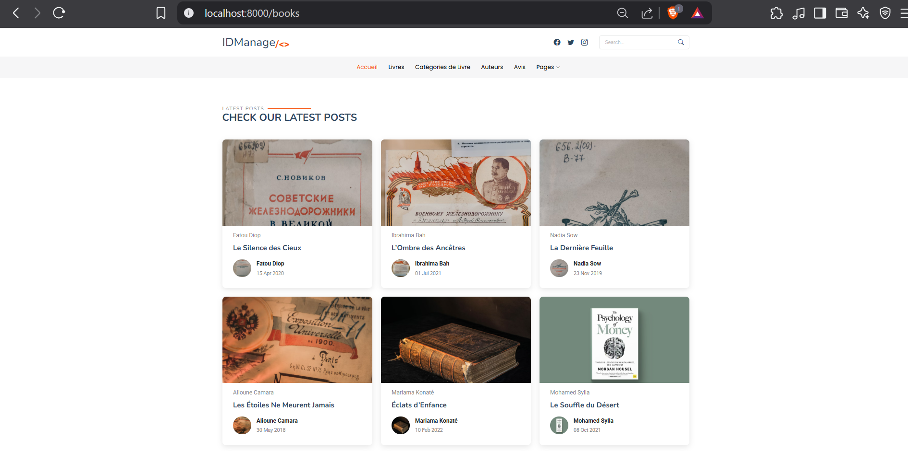
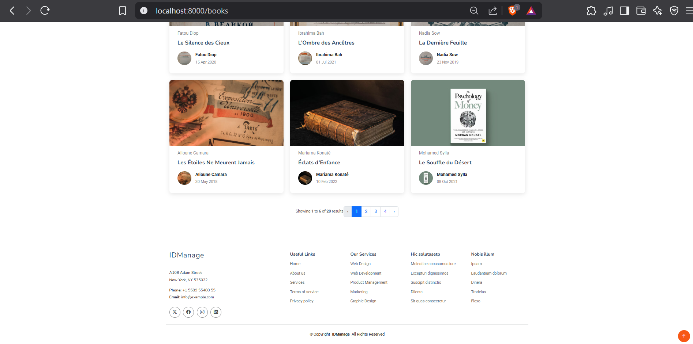
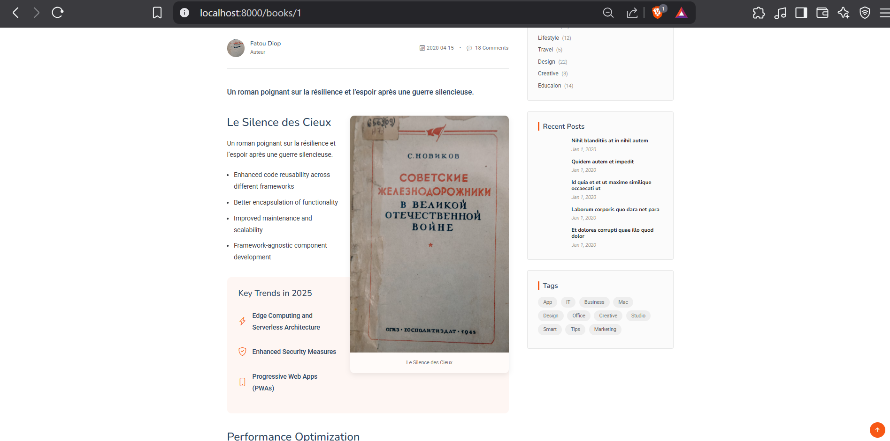
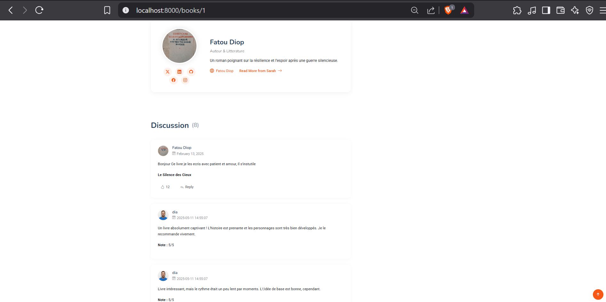
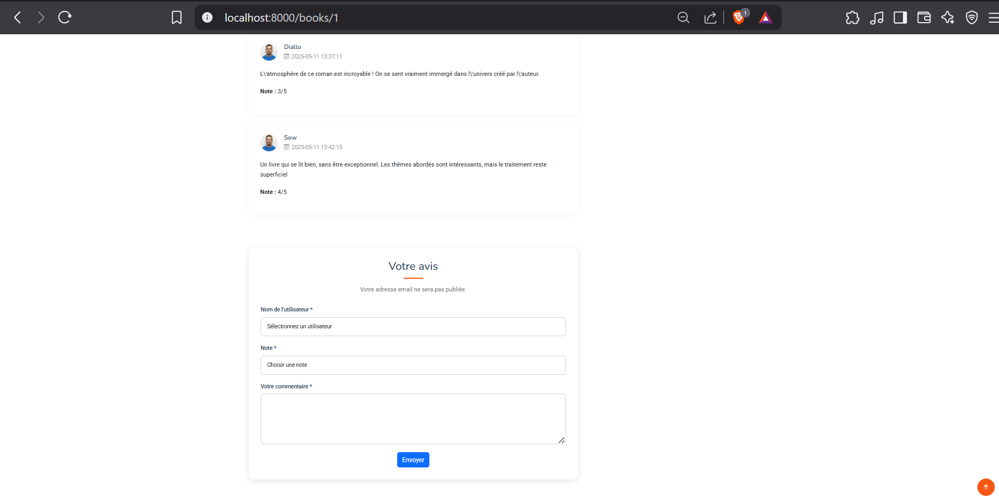

<p align="center"><a href="https://laravel.com" target="_blank"></a></p>
<p align="center">
  <a href="https://laravel.com" target="_blank">
    
  </a>
</p>

# 📚 Application Laravel – Gestion de Livres & Avis

## 🎯 Introduction

Cette application Laravel permet aux utilisateurs de consulter une liste de livres et d’ajouter des **avis** et **notes** sur ceux-ci, sans nécessiter d’authentification. L’objectif est de fournir une base de projet web pour afficher du contenu littéraire et recueillir les retours d’utilisateurs.

---

## 🧰 Fonctionnalités

### Utilisateurs
- Sélection d’un utilisateur dans un menu déroulant pour poster un commentaire.
- Pas besoin d’être authentifié pour poster un avis.

### Livres
- Liste de tous les livres.
- Détail complet d’un livre.
- Image, titre, auteur, description.

### Avis
- Ajout d’un avis avec nom, note (1-5) et commentaire.
- Affichage des avis par livre.
- Suppression des avis liés lors de la suppression du livre.

---

## 🔍 Aperçu de l'Interface

Voici quelques captures d'écran de l'interface utilisateur :

### 🏠 Page d’accueil (Liste des livres)






### 📖 Détails d’un livre avec avis




### 📝 Formulaire d'ajout d'avis



---

## 🧱 Structure de la base de données

### 📘 `books`

| Champ       | Type     | Description              |
|-------------|----------|--------------------------|
| id          | bigint   | ID du livre              |
| title       | string   | Titre du livre           |
| author      | string   | Auteur du livre          |
| description | text     | Résumé/description       |
| image       | string   | Image du livre           |
| created_at  | datetime | Date de création         |

---

### 👤 `users`

| Champ      | Type     | Description             |
|------------|----------|-------------------------|
| id         | bigint   | ID de l’utilisateur     |
| name       | string   | Nom                     |
| email      | string   | Adresse email           |
| password   | string   | Mot de passe hashé      |
| created_at | datetime | Date de création        |

---

### 🌟 `reviews`

| Champ     | Type         | Description                  |
|-----------|--------------|------------------------------|
| id        | bigint       | ID de l’avis                 |
| book_id   | foreign key  | Référence au livre           |
| user_id   | foreign key  | Référence à l’utilisateur    |
| rating    | tinyInteger  | Note entre 1 et 5            |
| comment   | text         | Contenu du commentaire       |
| created_at| datetime     | Date de publication          |

---

## ⚙️ Installation & Lancement

### ✅ Prérequis

- PHP >= 8.1
- Composer
- sqlite

### 🚀 Étapes d’installation

1. **Cloner le projet**
   ```bash
   git clone https://github.com/ThiernodioData/BibliothequeLaravel.git
   cd book-review-app

--------------
## Installer les dépendances PHP & JS

composer install


## Lancer le serveur


php artisan serve
Accéder à l’application via : http://localhost:8000

## 🌍 Routes principales
Méthode	URI	Contrôleur	Action
GET	/books	BookController	index
GET	/books/{id}	BookController	show
POST	/books/{book}/reviews	ReviewController	store

## 🛠️ Technologies utilisées
Framework : Laravel

Frontend : Blade, Bootstrap, CSS/HTML, js 

Base de données : Sqlite

Outils : Laravel Seeder, Eloquent ORM, Laravel Validation

👤 Auteur

Développé par ThiernoDio
https://github.com/ThiernodioData

